# Arkkitehtuurikuvaus

## Rakenne
Ohjelma koostuu kolmesta pakkauksesta noudattaen tehtävänannon esimerkkisovelluksen tapaan kolmitasoista kerrosarkkitehtuuria (kts. kuva alla). Pakkaukset ovat i. [woj.ui](https://github.com/toniramo/ot-harjoitustyo/tree/master/WeatherObservationJournal/src/main/java/woj/ui), ii. [woj.domain](https://github.com/toniramo/ot-harjoitustyo/tree/master/WeatherObservationJournal/src/main/java/woj/domain) ja iii. [woj.dao](https://github.com/toniramo/ot-harjoitustyo/tree/master/WeatherObservationJournal/src/main/java/woj/dao). Näistä ensimmäisen, woj.ui, sisältää käyttöliittymän toiminnallisuuden (toteutuksessa käytetty JavaFX-kirjastoa). Koodi woj.domain-pakkauksen alla sen sijaan vastaa ohjelman logiikasta. woj.dao-pakkauksen koodi vastaa tiedon pysyväistallennuksesta ja saatavuudesta.

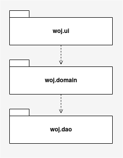

## Käyttöliittymä

Käyttöliittymä koostuu viidestä näkymästä
- kirjautumisnäkymä
- näkymä uuden käyttäjän luomiseen
- päänäkymä käyttäjän kirjauduttua, josta näkee käyttäjän kohteet ja kohdekohtaiset tiedot (graafina tai taulukkona)
- näkymä uuden havaintokohteen luomiseen
- näkymä uuden kohdekohtaisen havainnon luomiseen

joiden lisäksi käyttöliittymä tarjoaa popup-ikkunoita käyttäjän tiedottamiseen. Nämä erilliset ikkunat on toteutettu luokassa woj.ui.PopUpBox ja itse käyttöliittymä luokassa woj.ui.GUI.

Näkymät on toteutettu JavaFX-kirjaston Scene olioina ja nämä ovat vuorotellen liitettynä sovelluksen Stage-luokan toteuttamaan window-olioon. Näkymät päivittyvät samassa yhteydessä, kun näkymä vaihtuu toiseen.

Käyttöliittymän toteutuksessa on tavoiteltu tämän erittämistä sovelluslogista siten, että se kutsuu JournalService-luokan toteuttaman olion metodeja toiminnon edellyttämin parametrein. Se ei siis esimerkiksi ole suoraan yhteydessä pysyväistellennettuun tietoon.

## Sovelluslogiikka

Sovelluksen logiikka rakentuu kolmen luokan ympärille: User, Site ja Observation, jotka yhdessä muodostavat ohjelman datamallin. Luokat kuvaavat käyttäjiä (User), käyttäjien havaintokohteita (Site) sekä käyttäjien havaintokohteissa tekemiä havaintoja (Observation). 

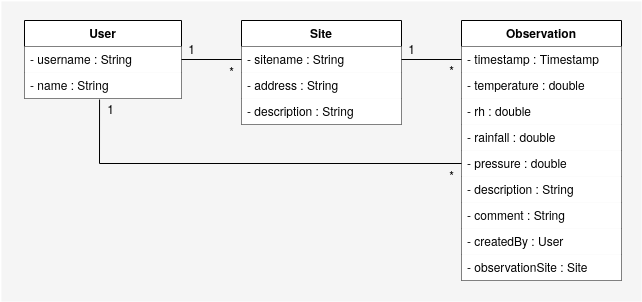

Sovelluksen JournalService-luokka vastaa toimintalogiikasta tarjoten ohjelman ylemmäntason toiminnallisuuksille (eli käyttöliittymälle) seuraavat metodit:

- login(String username)
- getLoggedUser()
- logout()
- createUser(String username, String name)
- createSite(Site site)
- getSitesOfLoggedUser()
- createObservation(Observation observation)
- getObservationsOfLoggedUserAndChosenSite(Site site)

JournalService-olioon liitetään woj.dao-pakkauksen luokkien UserDao-, SiteDao- ja ObservationDao-rajapinnat toteuttavat dao-luokat, joiden avulla JournalService pääsee pysyväistallennettuun tietoon käsiksi. Tallennettava tieto koskee datamallin mukaisesti käyttäjiä, kohteita ja havaintoja. Muiden ohjelman luokkien ja JournalServicen suhde on esitetty kaaviossa alla.

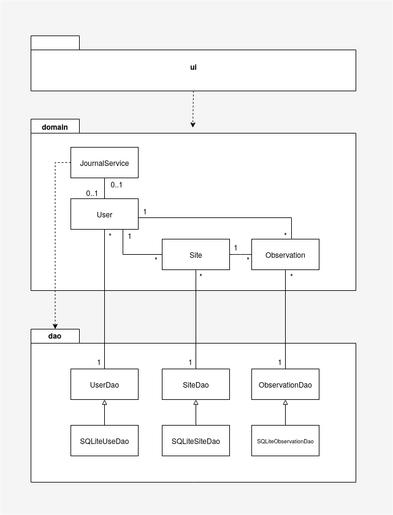

## Tietojen pysyväistallennus

Tietojen pysyväistallennuksesta vastaa pakkaus woj.dao ja tämän luokat SQLiteUserDao, SQLiteSiteDao sekä SQLiteObservationDao. Tieto tallennetaan toteutuksessa luokkien nimen mukaisesti SQLite-tietokantaan. Kukin luokka toteuttaa nimeä vastaavan rajapinnan (SQLiteUserDao rajapinnan UserDao, SQLiteSiteDao rajapinnan SiteDao ja SQLiteObservationDao rajapinnan ObservationDao) Data Access Object-suunnittelumallin mukaisesti. Muulla sovelluslogiikalla ei ole pääsyä suoraan rajapintoja toteuttaviin luokkiin, vaan vuorovaikutus tapahtuu rajapintojen kautta. Näin tallennuksesta vastaavia luokkia voidaan tarvittaessa muuttaa rikkomatta yhteensopivuutta muun sovelluslogiikan kanssa.

Suunnittelumallia noudattelemalla on mahdollistettu myös sovelluslogiikan testaaminen eristettynä varsinaisista tallennustavoista niin sanottujen vale-dao-luokkien avulla.

### Tietokanta

Sovellus tallentaa käyttäjien, kohteiden ja havaintojen tiedot samaan SQLite-tietokantaan kunkin kyseessä olevan luokan omille tauluilleen.

Tietokannan skeema on seuraava:

```
CREATE TABLE Users(id INTEGER PRIMARY KEY, username TEXT UNIQUE, name TEXT);
CREATE TABLE Sites(id INTEGER PRIMARY KEY, sitename TEXT UNIQUE, address TEXT, description TEXT, user_id INTEGER REFERENCES Users);
CREATE TABLE Observations(timestamp DATETIME, temperature REAL, rh REAL, rainfall REAL, pressure REAL, description TEXT, comment TEXT, site_id INTEGER REFERENCES Sites,user_id INTEGER REFERENCES Users);
```

Tietokantakaavio on esitetty alla:

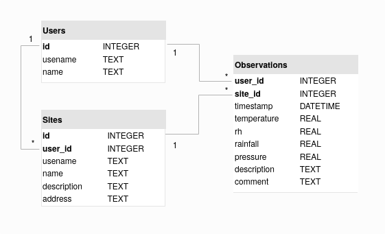

## Päätoiminnallisuudet

Alla on esitettynä sovelluksen toimitalogiikka päätoiminnallisuuksien osalta sekvenssikaavioiden muodossa.

### Uuden käyttäjän luominen

Uutta käyttäjää luodessa käyttäjä on navigoinut uuden käyttäjän luomiseen tarkoitettuun näkymään. Tässä hän on syöttänyt tekstikenttiin uniikin käyttäjänimen sekä käyttäjän varsinaisen nimen. Käyttäjän painaessa *createUserButton*-painiketta sovelluksen kontrolli etenee seuraavasti:

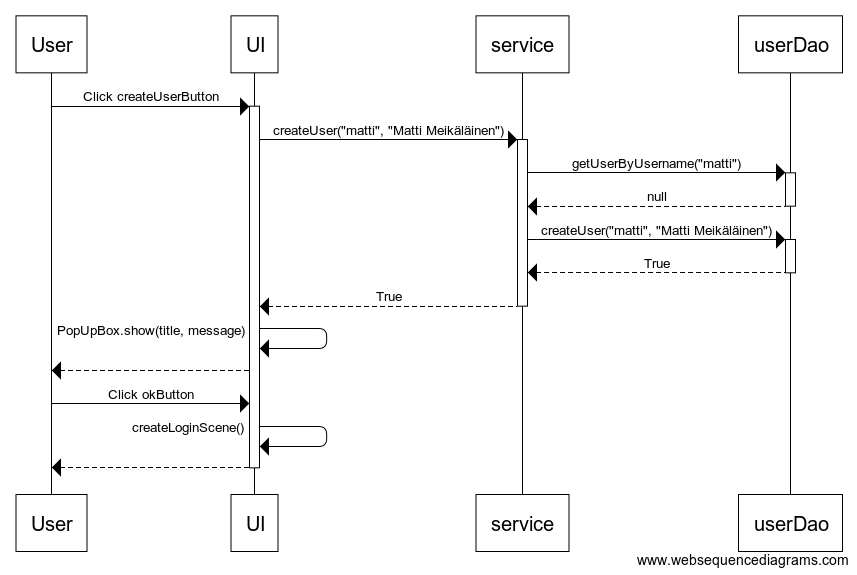

Tapahtumankäsittelijä kutsuu sovelluslogiikan (service) metodia *createUser* antamalla parametriksi tekstikenttien syötteet. Sovelluslogiikka tarkistaa userDao-olion avulla onko parametrina saatua käytäjänimeä jo tietokannassa. userDao palauttaa null-arvon, sillä käytäjää ei löydy. Nyt service lisää uuden käyttäjän userDaon createUser-metodin avulla tietokantaan. Käyttäjälle näytetään popup-ikkuna onnistuneesta käyttäjän luomisesta ja näkymää palaa sisäänkirjautumissivulle.

### Käyttäjän sisäänkirjaantuminen

Kirjautuessa käyttäjä on syöttänyt valmiiksi luodun käyttäjänimen sille osoitettuun kirjautumissivulla olevaan syötekenttään. Käyttäjän painaessa *loginButton*-painiketta etenee sovelluksen kontrolli seuraavasti:

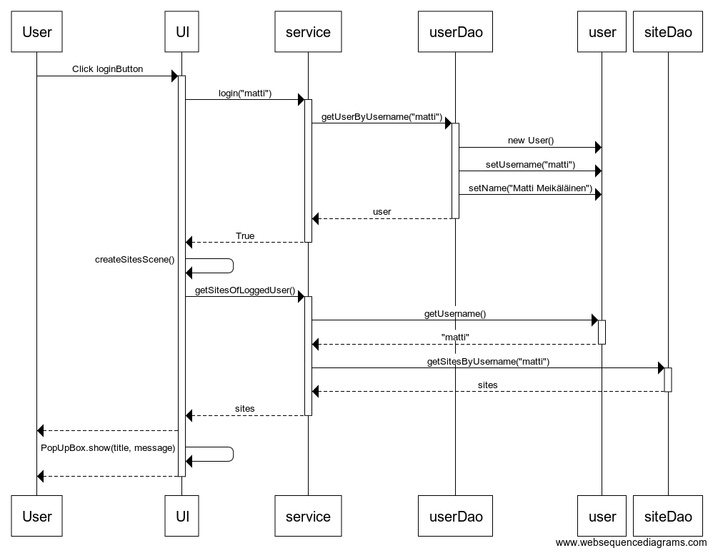

Tapahtumankäsittelijä reagoi painikkeen painamiseen ja kutsuu sovelluslogiikan (service) metodia login paramterinaan käyttäjän syöttämä käyttäjänimi. Service puolestaan kutsuu userDao-oliota, joka hakee tietokannasta kyseisellä käyttäjänimellä löytyvät tiedot ja palauttaa User-olion sovelluslogiikalle. Koska käyttäjä löytyi, tallentaa sovelluslogiikka kirjautuneen käyttäjän muistiin (loggedIn-muuttujaan) ja ilmoittaa onnistuneesta kirjautumisesta käyttöliittymälle. Tämä puolestaan toteuttaa sovelluksen päänäkymän (sitesScenen) vaihtaa sen käyttäjälle näkyväksi näkymäksi. Samassa yhteydessä käyttöliittymä kutsuu servicen *getSitesOfLoggedUser*-metodia, jolla sovelluslogiikka hakee siteDaon avulla käyttäjän kaikki havaintokohteet ja palauttaa nämä listana käyttöliittymälle. Käyttöliittymä lisää nämä päänäkymän sitesList-elementin sisällöksi. Käyttäjälle ilmoitetaan vielä popup-ikkunalla, että kirjautuminen onnistui.

### Käyttäjän kohteen valinta ja havaintotietojen esittäminen

Käyttäjä on päänäkymässä valinnut haluamansa havaintokohteen sitesList-elementistä ja painaa chooseSiteButton-painiketta. Tällöin sovelluksen kontrolli etenee alla esitetyllä tavalla:

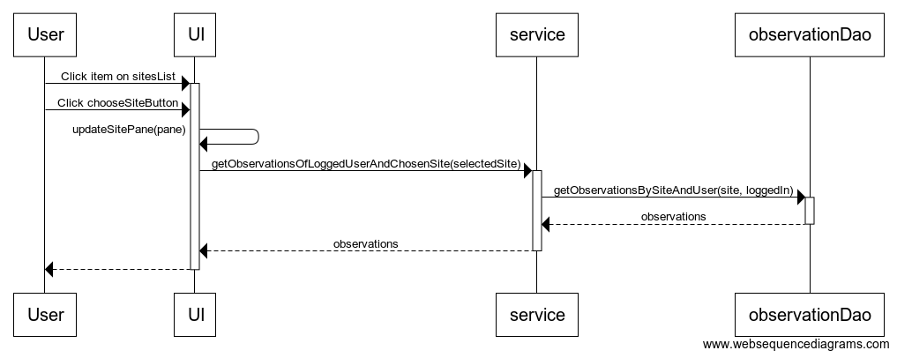

Painikkeen painamiseen reagoituaan käyttöliittymä kutsuu metodia *updateSitePane*, jonka tuloksena päivitetään päänäkymän kohdekohtainen osio (näkymän oikea puoli).  Käyttöliittymä kutsuu servicen metodia *getObservationsOfLoggedUserAndChosenSite* käyttäen parametrina käyttäjän valitsemaa kohdetta. Service puolestaan kutsuu observationDaon *getObservationsBySiteAndUser* paramterina käyttäjän valitsema kohde ja kirjautunut käyttäjä (loggedIn). observationDao palauttaa listan kyseisen havaintokohteen ja käyttäjän havainnoista, jonka service välittää käyttöliittymälle. Käyttöliittymä päivittää riippuen valitusta havaintojen esitystavasta (graafi vai taulukko), esillä olevan elementin sisällön sovelluslogiikalta saadun listan mukaisesti.

### Uuden havaintokohteen luominen

Uuden havaintokohteen luomiseen tarkoitetussa näkymässä käyttäjän syötettyä validit syötteet syötekenttiin ja painettuaan *createSiteButton*-painiketta tapahtuu kontrollin osalta seuraavaa:

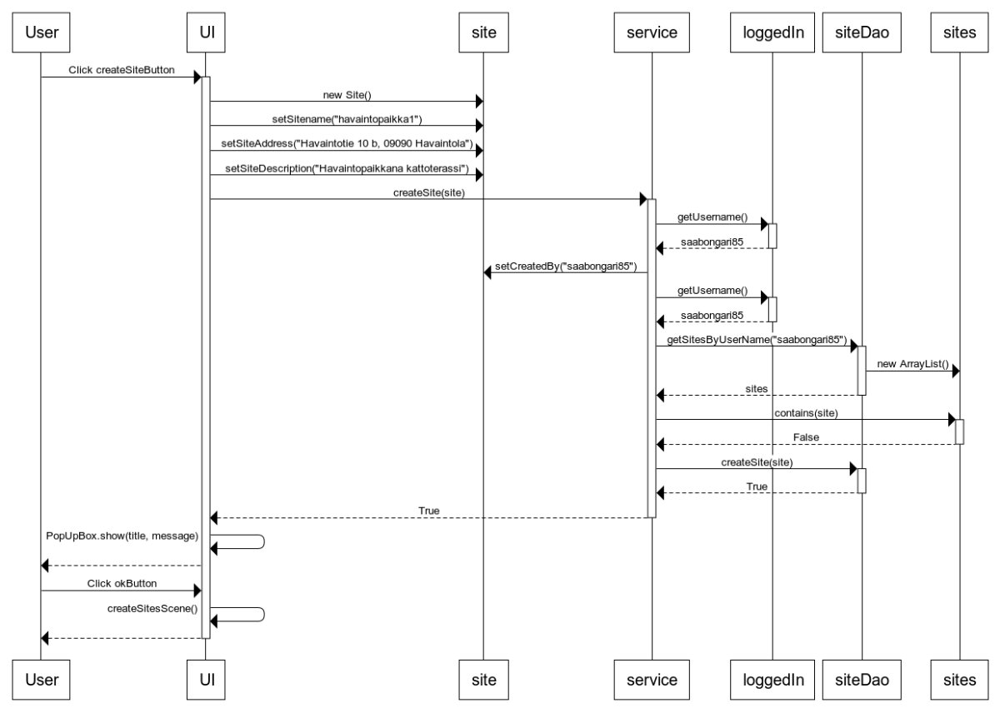

Tapahtumankäsittelijä havaitsee painikkeen painamisen ja luo uuden site-olion ja asettaa sille syötekenttien tiedot (nimen, osoitteen ja kuvauksen). Tämän jälkeen se kutsuu sovelluslogiikan *createSite*-metodia parametrina site-olio. service asettaa oliolle vielä kirjautuneen käyttäjän nimen. Tämän jälkeen se varmistaa, ettei vastaavaa kohdenimeä löydy ennestään kyseisen käyttäjän tiedoista siteDaon *getSitesByUsername*-metodin avulla. Koska metodin paluuarvona saatava kohdelista ei sisällä kyseistä kohdetta (site-oliota, jolla olisi sama nimi), kutsuu se nyt siteDaon *createSite*-metodia käyttäen parametrina luotua site-oliota. siteDao palauttaa *True*-arvon lisäyksen onnistuttua. service välittää vastaavan arvon käyttöliittymälle, joka ilmoittaa nyt käyttäjälle popup-ikkunalla lisäämisen onnistuneen. Päänäkymä luodaan uudestana ja palautetaan käyttäjälle näkyväksi näkymäksi.

### Uuden havainnon luominen

Uuden havainnon luomista varten käyttäjä on navigoinut sille tarkoitettuun näkymään ja syöttänyt validit tiedot havaintotietoja varten esitettyihin syötekenttiin. Tämän painaessa *createObservationButton*-painiketta etenee kontrolli seuraavasti:

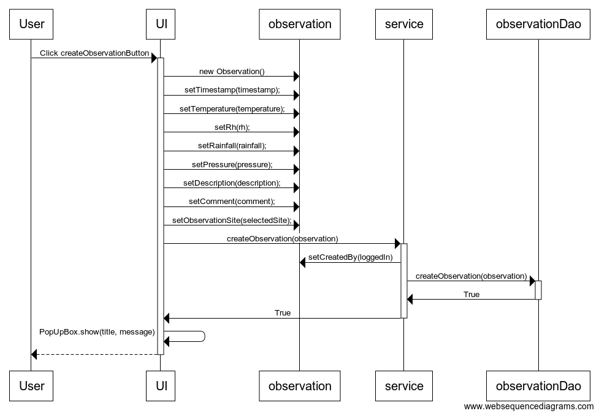

Painikkeen painamiseen regaoiva tapahtumankäsittelijä luo uuden observation-olion ja asettaa sille käyttäjän syötteiden mukaiset ominaisuudet. Tämän jälkeen se kutsuu sovelluslogiikan (service) *createObservation*-metodia antaen parametrina observation-olion. Service lisää olioon tiedon käyttäjästä *setCreatedBy*-metodilla parametrina kirjautunut käyttäjä (loggedIn). Service kutsuu sitten observationDaon metodia *createObservation*-metodia syöttäen parametrina observation-olion. observationDao palauttaa onnistuneen lisäyksen jälkeen servicelle arvon *True*. Sovelluslogiikka palauttaa vastaavasti käyttöliittymälle *True*-paluuarvon. Käyttöliittymä näyttää käyttäjälle popup-ikkunan ja ilmoittaa havainnon lisäämisen onnistuneen ja nollaa kentät uuden havainnon syöttämistä varten.

### Käyttäjän uloskirjautuminen

Käyttäjä voi valita päänäkymän menu-pudotusvalikon (*dropdownMenu*) kautta "Logout"-toiminnon. Tämän valitessaan etenee sovelluksen kontrolli seuraavalla tavalla:

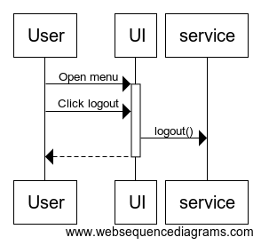

Tapahtumankäsittelijä havaitsee pudotusvalikosta valitun toiminnon. Tämän jälkeen se kutsuu vastaavasti sovelluslogiikan (service) *logout*-metodia. service kirjaa tällöin käyttäjän ulos asettamalla loggedIn-olin arvoksi null. Käyttöliittymän näkymäksi vaihdetaan loginScene-näkymä.

### Ohjelman sulkeminen

Käyttäjän ollessa kirjautumisnäkymässä ja painaessa *exitButton*-painiketta sovelluksen kontrollissa tapahtuu seuraavaa:

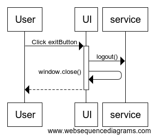

Painikkeen painamisen jälkeen tapahtumankäsittelijä havaitsee painalluksen ja kutsuu sovelluslogiikan *logout*-metodia, jotta service tietää käyttäjän kirjautuneen ulos ja asettaa kirjautuneen käyttäjän (loggedIn) nulliksi. Sitten käsittelijä kutsuu JavaFXn Stage-luokan toteuttavan window-olion *close()*-metodia, joka sulkee käyttäjälle näkyvän ikkunan ja sovelluksen suoritus päättyy.

Vastaava tapahtuu myös käyttäjän sulkiessa ohjelman päänäkymän *dropdownMenu*-valikon Exit-toiminnon kautta.

## Ohjelman rakenteelliset heikkoudet

### DAO-luokat

Sovelluksen DAO-luokissa on muutamia pitkiä metodeita tiedonlukua varten, joiden sisällöissä on toistoa. DAO-luokat voisivat hyödyntää toistensa metodeita, jotta samanlaisia hakuja ei tarvitsisi toteuttaa eri luokissa. Esimerkiksi, *SQLiteObservationDao*-luokassa haetaan havaintoa luodessa (*createObservation*-metodi) tietokannasta *userId* ja *siteId* (kts. [SQLiteObservationDao.java, rivit 86 ja 87](https://github.com/toniramo/ot-harjoitustyo/blob/master/WeatherObservationJournal/src/main/java/woj/dao/SQLiteObservationDao.java#L86). Näiden hausta voisi vastata käyttäjien ja kohteiden tietojen hallintaan toteutetut SQLiteUserDao ja SQLiteSiteDao -luokat, jotka voitaisiin esimerkiksi antaa SQLiteObservation-luokan toteuttavalle oliolle konstruktin parametrina ja SQLiteObservationDao saisi käyttäjiin ja kohteiden tietojen käsittelyyn liittyvät haut käyttöönsä toistamatta samaa koodia.

### Käyttöliittymä

Käyttöliittymä on rakennettu PopUpBox-luokka poislukien kokonaan GUI-luokan sisälle. Ohjelman ylläpidettävyyden kannalta olisi järkevämpi eriyttää käyttöliittymän toiminnot omikse luokikseen. Tällä voisi myös mahdollisesti vähentää käyttöliittymässä esiintyvää toisteista koodia.

Vaihdettaessa näkymää toiseen olisi järkevämpää toteuttaa näkymien päivittäminen omalla metodilla tai muita JavaFXn toimintoja hyödyntämällä piirtämättä jokaisessa tilanteessa näkymää kokonaan uudelleen. Näin tapahtuu esimerkiksi palattaessa uuden havaintokohteen luomiseen tarkoitetusta näkymästä takaisin käyttäjän päänäkymään (kts. [GUI.java, rivi 506](https://github.com/toniramo/ot-harjoitustyo/blob/master/WeatherObservationJournal/src/main/java/woj/ui/GUI.java#L506)).


