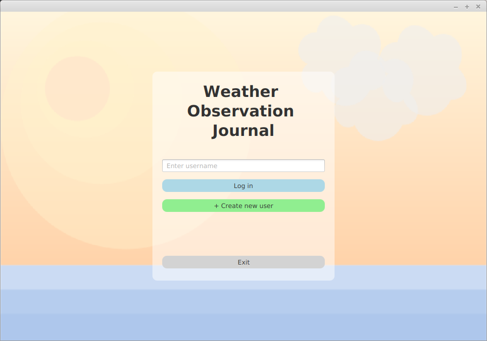
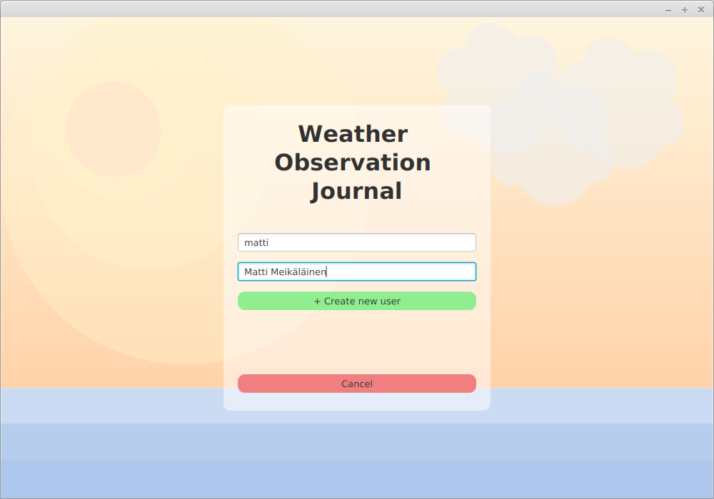
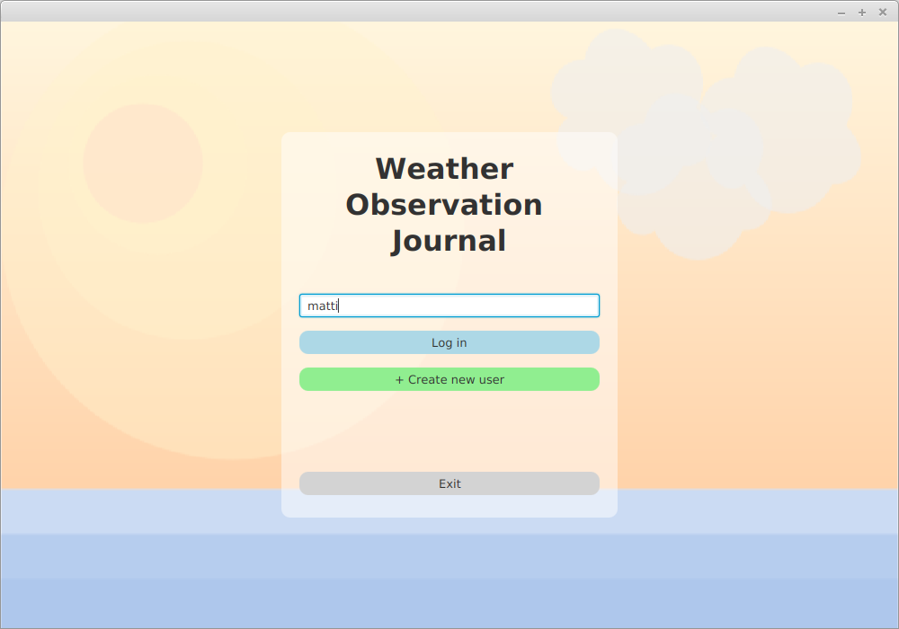
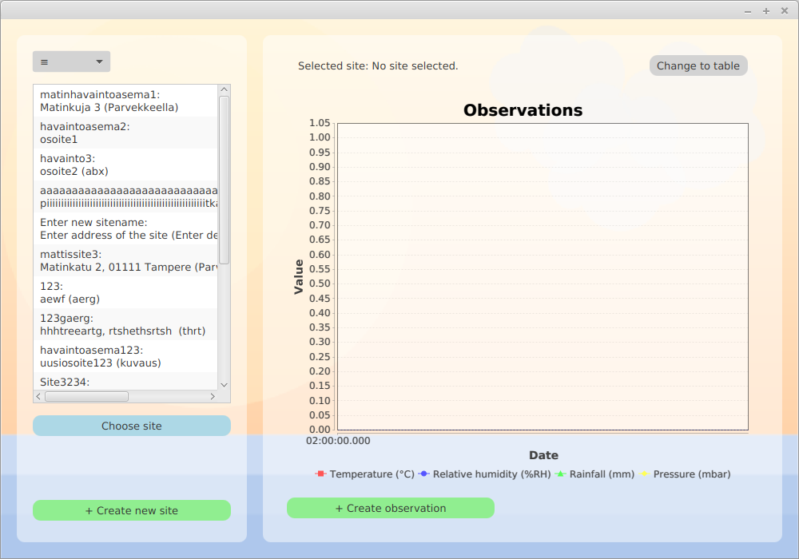
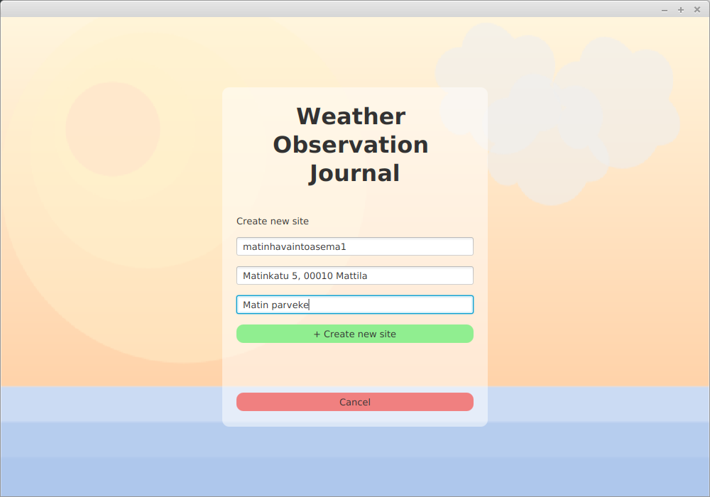
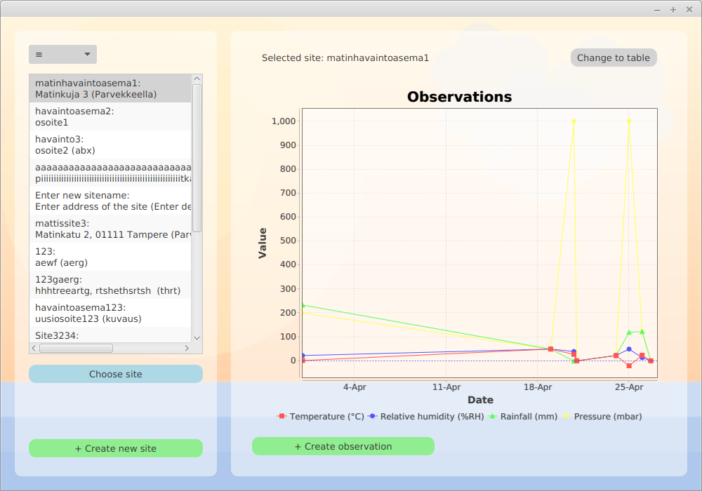
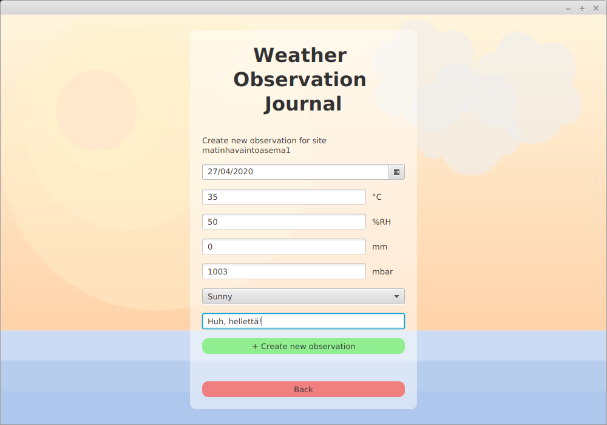
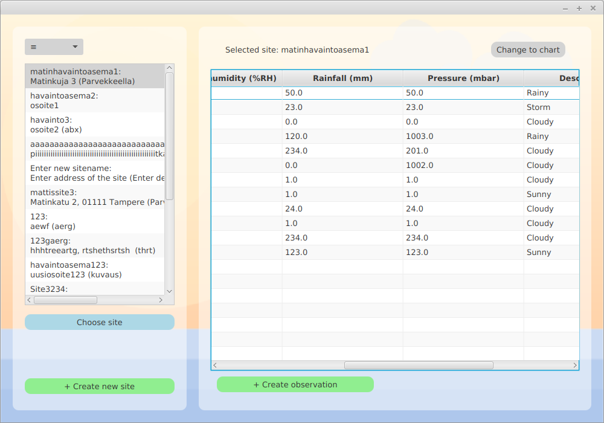

# Käyttöohje

## Uuden käyttäjätunnuksen luominen
Sovellus auvautuu kirjautumisnäkymään. Tästä on mahdollista navigoida näkymään, jossa voi luoda uuden käyttäjän painamalla "+ Create new user".

Syöttämällä pyydetyt tiedot oikein (uniikin käyttäjätunnuksen sekä käyttäjänimen) ilmoittaa käyttöliittymä tunnuksen luomisen onnistuneen ja palautuu kirjautumisnäkymään.

## Kirjautuminen
Luotuasi käyttäjätunnuksen voit kirjautua aloitus- eli kirjautumisnäkymästä sisään syöttämällä käyttäjätunnuksen syötekenttään ja painamalla "login".

## Havaintokohde-näkymä ja kohteen luominen
Kirjauduttuasi sovellus aukeutuu havaintokohdenäkymään, joka on sovelluksen päänäkymä. Tästä voit valita havaintokohteesi, tarkastella tämän tietoja, luoda uuden havaintokohteen tai havainnon.

Pääset luomaan uuden havaintokohteen painamalla "+ Create new site"-painiketta.

Voit luoda kohteen syöttämällä pyydetyt tiedot syötekenttiin (havaintokohteen uniikki nimi, osoite ja vapaaehtoinen kuvaus). Käyttöliittymä ilmoittaa syötteen onnistumisesta ja kohteen luomisen onnistuessa palaa näkymä päänäkymään.

## Kohteen valinta ja havainnon luominen
Havaintokohteen luotuasi voit valita kohteen, tarkastella tämän tietoja ja lisätä sille uusia säähavaintoja. Kohteen valitseminen tapahtuu painamalla ensin kohdelistauksesta näkymän oikealla reunalla haluttua kohdetta ja painamalla "Choose site". Näkymän yläreunan "Selected site:"-teksti ilmaisee nyt valitun kohteen nimen. 

Pääset luomaan uuden havainnon nyt kohteen ollessa valittuna painamalla "+ Create observation"-painiketta.

Pääset avautuvassa näkymässä luomaan valitsemallesi kohteelle uuden havainnon syöttämällä pyydetyt tiedot kuhunkin syötekenttään (valitse päiväys, syötä päivän lämpötilan, kosteuden, sademäärän, ilmanpaineen, säänkuvauksen ja vapaaehtoisen kommentin tiedot). Käyttöliittymä ilmoittaa, mikäli syöte oli onnistunut. Luotuasi havainnon onnistuneesti, voit jatkaa samassa näkymässä kunnes olet lisännyt kaikki haluamasi havainnot kohteelle. Kun olet valmis, voit navigoida takaisin päänäkymään "Back"-painikkeella.

## Kohteen tietojen tarkastelemisen vaihtoehdot

Nyt, kun olet luonut sekä säähavaintokohteen (tai kohteita) sekä säähavaintoja, voit tarkastella näitä valitemalla jälleen päänäkymästä haluamasi kohteen vasemmanpuoleisesta listauksesta ja painamalla "Choose site". Oletusarvoisesti näkymä luo graafi-esityksen valitun kohteen havaintojen numeerisista tiedoista (lämpötilasta, ilman suhteellisesta kosteudesta, sademäärästä ja ilmanpaineesta). Graafi on interaktiivinen ja mahdollistaa zoomauksen lähemmäs ja kauemmas. Tarkastelu lähempää tapahtuu maalaamalla haluttu alue ja tarkastelu kaumpaa tapahtuu pyörittämällä hiiren rullaa.

Mikäli haluat tarkastella kohteen tietoja vaihtoehtoisella taulukkoesitystavalla, paina valittuasi kohteen "Change to table"-painiketta näkymän oikeasta yläreunasta. Tässä näkymässä näet kaikki havaintoihin syötetyt tiedot (myös kuvauksen ja kommentin). Pääset takaisin graafi-näkymään painamalla "Change to chart"-painiketta näkymän oikeasta yläreunasta.

## Uloskirjautuminen ja ohjelman sulkeminen
Uloskirjautuminen tapahtuu päänäkymän vasemmassa yläreunassa olevan "≡"-pudotusvalikon kautta. Paina sitä ja valitse "Log out". Samasta valikosta on mahdollista myös lopettaa ohjelman käyttö kokonaan valitsemalla "Exit". Samaan lopputulokseen pääsee kirjautumisnäkymästä kirjauduttuasi ulos ja painamalla näkymän "Exit"-painiketta.
