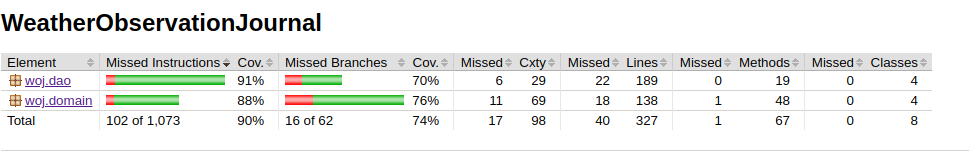

# Testausdokumentti

Ohjelmaa on testattu yksikkö-, integraatio- ja järjestelmätasolla. Yksikkö- ja integraatiotestit on toteutettu pääasiassa automatisoiduin JUntin testein. Järjestelmätason testit on toteutettu manuaalisesti.

## Yksikkö- ja integraatiotestaus

### Domain

[woj.domain](https://github.com/toniramo/ot-harjoitustyo/tree/master/WeatherObservationJournal/src/main/java/woj/domain)-pakkauksen toteuttama sovelluslogiikka on testattu [JournalService.java](https://github.com/toniramo/ot-harjoitustyo/blob/master/WeatherObservationJournal/src/main/java/woj/domain/JournalService.java)-luokan ympärille toteutetuilla integraatiotesteillä:

- [JournalServiceUserTest.java](https://github.com/toniramo/ot-harjoitustyo/blob/master/WeatherObservationJournal/src/test/java/woj/domain/JournalServiceUserTest.java)

- [JournalServiceSiteTest.java](https://github.com/toniramo/ot-harjoitustyo/blob/master/WeatherObservationJournal/src/test/java/woj/domain/JournalServiceSiteTest.java)

- [JournalServiceObservationTest.java](https://github.com/toniramo/ot-harjoitustyo/blob/master/WeatherObservationJournal/src/test/java/woj/domain/JournalServiceObservationTest.java)

Testauksessa simuloidaan käyttöliittymän suorittamia toimintoja JournalService-luokan avulla.

Testitapauksissa käytetään vale-dao-luokkia

- [FakeUserDao.java](https://github.com/toniramo/ot-harjoitustyo/blob/master/WeatherObservationJournal/src/test/java/woj/domain/FakeUserDao.java)

- [FakeSiteDao.java](https://github.com/toniramo/ot-harjoitustyo/blob/master/WeatherObservationJournal/src/test/java/woj/domain/FakeUserDao.java)

- [FakeObservationDao.java](https://github.com/toniramo/ot-harjoitustyo/blob/master/WeatherObservationJournal/src/test/java/woj/domain/FakeObservationDao.java)

, jotka ovat keskusmuistitoteutuksia todellisista dao-luokista. Näiden avulla JournalServicen testaus on eriytetty todellisten dao-luokkien toiminnoista.

Lisäksi [User.java](https://github.com/toniramo/ot-harjoitustyo/blob/master/WeatherObservationJournal/src/main/java/woj/domain/User.java), [Site.java](https://github.com/toniramo/ot-harjoitustyo/blob/master/WeatherObservationJournal/src/main/java/woj/domain/Site.java) ja  	[Observation.java](https://github.com/toniramo/ot-harjoitustyo/blob/master/WeatherObservationJournal/src/main/java/woj/domain/Observation.java)-luokkien equals-metodien testaamiseen on toteutettu omat yksikkötestinsä:

- [UserTest.java](https://github.com/toniramo/ot-harjoitustyo/blob/master/WeatherObservationJournal/src/test/java/woj/domain/UserTest.java)

- [SiteTest.java](https://github.com/toniramo/ot-harjoitustyo/blob/master/WeatherObservationJournal/src/test/java/woj/domain/SiteTest.java)

- [ObservationTest.java](https://github.com/toniramo/ot-harjoitustyo/blob/master/WeatherObservationJournal/src/test/java/woj/domain/ObservationTest.java)

### Dao-luokat

[woj.dao](https://github.com/toniramo/ot-harjoitustyo/tree/master/WeatherObservationJournal/src/main/java/woj/dao)-pakkauksen luokkien toiminta on testattu erillisellä `wojTest.db`-nimisellä tietokannalla, joka poistetaan jokaisen testitapauksen päätteeksi. Tästä syystä käyttäjän ei ole mahdollista käyttää samannimistä tietokantaa sovelluksen tietojen pysyväistallennukseen (määritellään config.properties tiedostossa).

### Käyttöliittymä

Käyttöliittymän testaus on toteutettu manuaalisesti eikä sille ole toteutettu automatisoituja yksikkö- tai integraatiotason testejä.

### Laajemmat testit

Testauksessa on toteutettu myös samanaikaisesti domain- ja dao-luokkia hyödyntävät integraatiotestit luokassa [DomainDaoIntegrationTest.java](https://github.com/toniramo/ot-harjoitustyo/blob/master/WeatherObservationJournal/src/test/java/woj/domain/JournalServiceObservationTest.java).

### Testikattavuus

Ohjelman automatisoitujen testien kattavuus on käyttöliittymäkerros poislukien seuraava:

- rivikattavuus 90% 
- haaraumakattavuus 74%

Testikattavuudesta erityisesti haaraumakattavuutta alentaa erilaisten tiedostojen pysyväistallennukseen liittyvien virhe- / poikkeustilanteet huomiotta jättäminen testauksen osalta.

## Järjestelmätestaus

Ohjelmiston järjstelmätason testaus on toteutettu manuaalisesti.

### Ohjelman käyttöönotto ja konfigurointi

Sovellus on otettu käyttöön ja testattu [käyttöohjeen](https://github.com/toniramo/ot-harjoitustyo/blob/master/dokumentointi/kayttoohje.md) määrittelemällä tavalla seuraavissa tilanteissa:

- ohjeistuksessa neuvottu `config.properties`-tiedosto on ollut olemassa käynnistyshakemistossa, ja siinä on käytetty
  - uniikkia tietokannan nimeä
  - oletusnimeä (woj.db)
  - testitietokannan nimeä (wojTest.db)
  - tyhjää nimeä
- ohjeistuksessa neuvottu `config.properties`-tiedostoa ei ole ollut olemassa.
- sovelluksen pysyväistallennukseen vaadittava tietokanta
  - on jo ollut olemassa
  - ei ole ollut olemassa. Tällöin sovellus on luonut sen.

Kaikissa tilanteissa pyydetty `images/background.png` on löytynyt käynnistyshakemistossa.

### Ohjelman toiminnallisuudet

Sovelluksen [käyttöohjeessa](./kayttoohje.md) ja [määrittelydokumentissa](vaatimusmaarittely.md) mainitut toiminnallisuudet on testattu erilaiset mahdolliset tilanteet huomioiden. Esimerkiksi syötekentät on käyty läpi siten, että kunkin kohdalla on otettu huomioon tilanteet, joissa käyttäjä syöttää validin syötteen ja toisaalta tilanteet, joissa syöte on virheellinen.

## Sovelluksen laadulliset puutteet

Sovelluksen kehityksessä ja testauksessa ei ole otettu huomioon tilannetta, joissa 
- joko käyttäjän määrittelemään tai sovelluksen oletustietokantaan ei ole luku- ja/tai kirjoitusoikeutta
- sovelluksen lukema tietokanta on ollut jo olemassa, mutta sen skeema ei ole sovelluksen olettama
