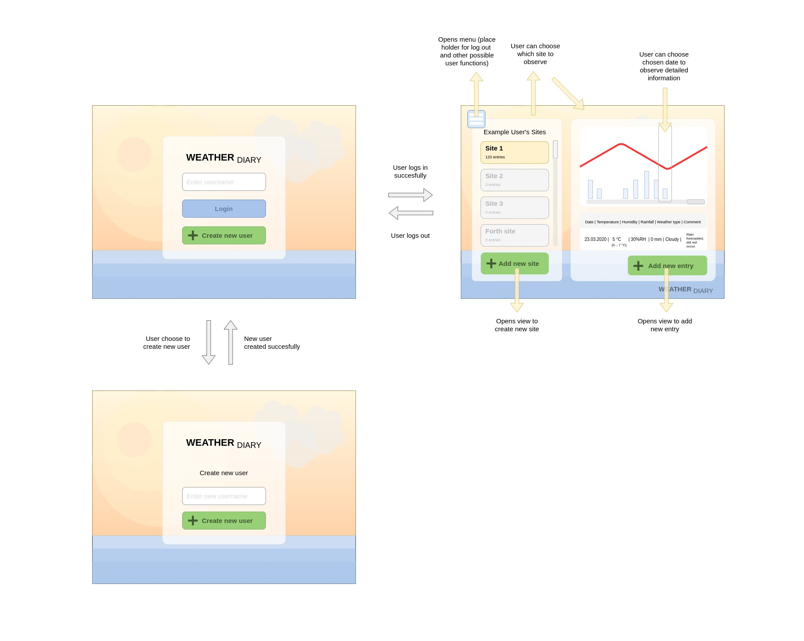

# Vaatimusmäärittely

## Sovelluksen tarkoitus
Sovelluksen avulla käyttäjät voivat pitää henkilökohtaista säähavaintopäiväkirjaa lisäämällä havaintokohteilleen päiväkohtaisia merkintöjä ja selata jo tehtyjä muistiinpanoja. Sovellus mahdollistaa merkintöjen tarkastelun visuaalisessa muodossa.

## Käyttäjät
Sovelluksen perustoiminnallisuuden kannalta olennaista on, että siitä löytyy peruskäyttäjärooli, joka mahdollistaa sovelluksen päätoiminnallisuuksien käytön. Jatkokehitystavoitteena on lisätä myös admin-tason käyttäjärooli, joka voi hallinnoida sovelluksen käyttäjiä ja heidän tietojaan sekä tarkastella jokaisen käyttäjän lisäämiä merkintöjä. Peruskäyttäjä voi tarkastella ja hallinnoida vain omia tietojaan - ellei käyttäjähallintaa tehdä edistyneemmäksi jatkossa.

## Suunnitellut toiminnallisuudet

### Ennen kirjautumista
- käyttäjä voi luoda käyttäjätunnuksen sovellusta varten
  - Tunnuksen on oltava uniikki ja sisältää vähintään yhden merkin
- käyttäjä voi kirjautua järjestelmään jo olemassa olevalla tunnuksella
  - salasanan käyttöä ei vaadita perustoiminnallisuuden näkökulmasta eikä tukea sille ole toistaiseksi toteutettu

### Kirjauduttua
- käyttäjä näkee omat säähavaintokohteensa
- käyttäjä voi luoda uuden havaintokohteen
  - kohteen nimen tulee olla uniikki ja vähintään yhden merkkin pituinen
  - kohteella tulee olla osoite, joka on vähintään kolmen merkin pituinen
  - kohteelle voi antaa kuvauksen, mutta kentän voi myös jättää tyhjäksi
- käyttäjä voi valita olemassa olevan havaintokohteensa ja tarkastella tämän tietoja joko graafilla tai tekstimuodossa
  - käyttöliittymä näyttää kohteelle merkityn numeerisen tiedon graafilla
  - vaihtoehtoisesti käyttöliittymä näyttää havaintotiedot tekstimuodossa taulukkonäkymänä
  - käyttäjä voi vaihtaa näkymää halutessaan
  - kohteiden päiväkohtaiset tiedot sisältävät päivämäärän, lämpötilan, ilmankosteuden, sademäärän, sään kuvauksen: aurinkoista (Sunny), pilvistä (Cloudy), sateista (Rainy), myrskyisää (Stormy) sekä vapaamuotoisen kommentin.
- käyttäjä voi valita havaintokohteen ja valittuaan lisätä uuden säähavainnon kohteelle
  - käyttäjä voi vaihtaa päivämäärää, jos se on joku muu kuin kyseinen päiväkohtaiset
  - käyttäjän tulee syöttää validi lämpötila välillä -60 ja +60 astetta
  - käyttäjän tulee syöttää validi ilmankosteus välillä 0 ja 100%RH
  - käyttäjän tulee syöttää validi sademäärä (suurempi tai yhtäsuuri kuin 0 mm)
  - käyttäjän tulee syöttää validi ilmanpaine (suurempi kuin 0 mbar)
  - käyttäjän tulee valita joku neljästä säänkuvauksesta
  - käyttäjä voi halutessaan syöttää kommentin tai jättää kentän tyhjäksi
  - käyttöliittymä validoi syötteet havaintoa lisättäessä ja ilmoittaa, mikäli syötteissä on virheitä
- käyttäjä voi kirjautua ulos

## Käyttöliittymäluonnos
Sovelluksen avatuessa käyttöliittymä aukeaa kirjautumissivulle, jossa käyttäjä voi joko kirjautua olemassa olevalla tunnuksella sisään tai luoda uuden tunnuksen. Kirjautumisen jälkeen avautuu niin sanottu päänäkymä, jossa listataan kirjautuneen käyttäjän kohteet ja näytetään valitun kohteen yksityiskohtaisemmat havaintotiedot. Näkymästä on mahdollisuus myös siirtyä luomaan uusi kohde tai uusi havaintomerkintä valitulle kohteelle. Käyttöliittymään olisi tarkoitus toteuttaa pudotusvalikko, jonka takaa löytyy toiminnot esimerkiksi käyttäjätietojen hallintaan ja uloskirjautumiseen. Käyttöliittymään on mahdollisuus toteuttaa palauteviestejä syötteiden yhteyteen, jotta käyttäjä tietää onko syöte ollut validi vai ei (ja miksi, jos ei).

Kommentti: Huomaa, että käyttöliittymäluonnoksessa nimi on vielä ollut "Weather Diary", joka on sittemmin vaihtunut nimeksi "Weather Observation Journal".

## Jatkokehitysideoita
- edistyneempi tiedon hallinta
  - säähavaintojen import/export-toiminto, jonka avulla käyttäjä voi viedä/tuoda järjestelmään/järjestelmästä havaintoja tietyssä formaatissa esimerkiksi csv-tiedostona
  - graafien vienti-toiminto
  - generoitavat kohdetason raportit (esimerkiksi eri kausien vertailu, eri kohteiden vertailu, minimi- ja maksimilämpötilat, keskiarvot jne.)
  - olemassaolevan tiedon muokkaaminen
- edistyneempi käyttäjähallinta ja tiedon jakaminen käyttäjien kesken
  - erilaiset käyttäjäroolit - erityisesti admin-tason käyttäjä-rooli, jonka avulla voi tarkastella, muokata tai jopa poistaa kaikkien käyttäjien tietoja ja oikeuksia 
  - mahdollisuus jakaa kohdeoikeuksia käyttäjien/ryhmien kesken
  - eritasoiset käyttäjäoikeudet saattavat edellyttää myös salasanan käyttöönottoa
- mahdollisuus käyttöliittymän kustomoiduille näkymille
  - esimerkiksi kielen vaihtaminen, tiedon sijoittelu ja näyttäminen/piilottaminen
- kohteiden, käyttäjien ja havaintojen lisätiedot
  - mahdollisuus lisätä muuta materiaalia kuten valokuvia havaintojen tueksi
  - mahdollisuus lisätä merkintöjä tarkemmin kuin päivätasolla
  - mahdollisuus lisätä havaintokohteille lisätietoja kuten osoitetietoja, koordinaatteja ja muita huomioita
  - mahdollisuus lisätä käyttäjäkohtaista tietoa pelkän käyttäjänimen lisäksi
- edistyneempi tiedon visuaalinen esitystapa
  - mahdollisuus muuttaa graafin skaalaa ja zoomata
  - mahdollisuus muuttaa näytettäviä sarjoja
  - kohteiden näyttäminen kartalla (edellyttää koordinaattitietojen lisäämistä)
- kohdelistauksessa merkintöjen määrän ja mahdollisen muun kohdetiedon maininta
- mahdollisuus synkronoida tietoja todellisen sääaseman avointen tietojen kanssa ja lisätä kohteille ennustetieto
- interaktiiviset käyttöohjeet
